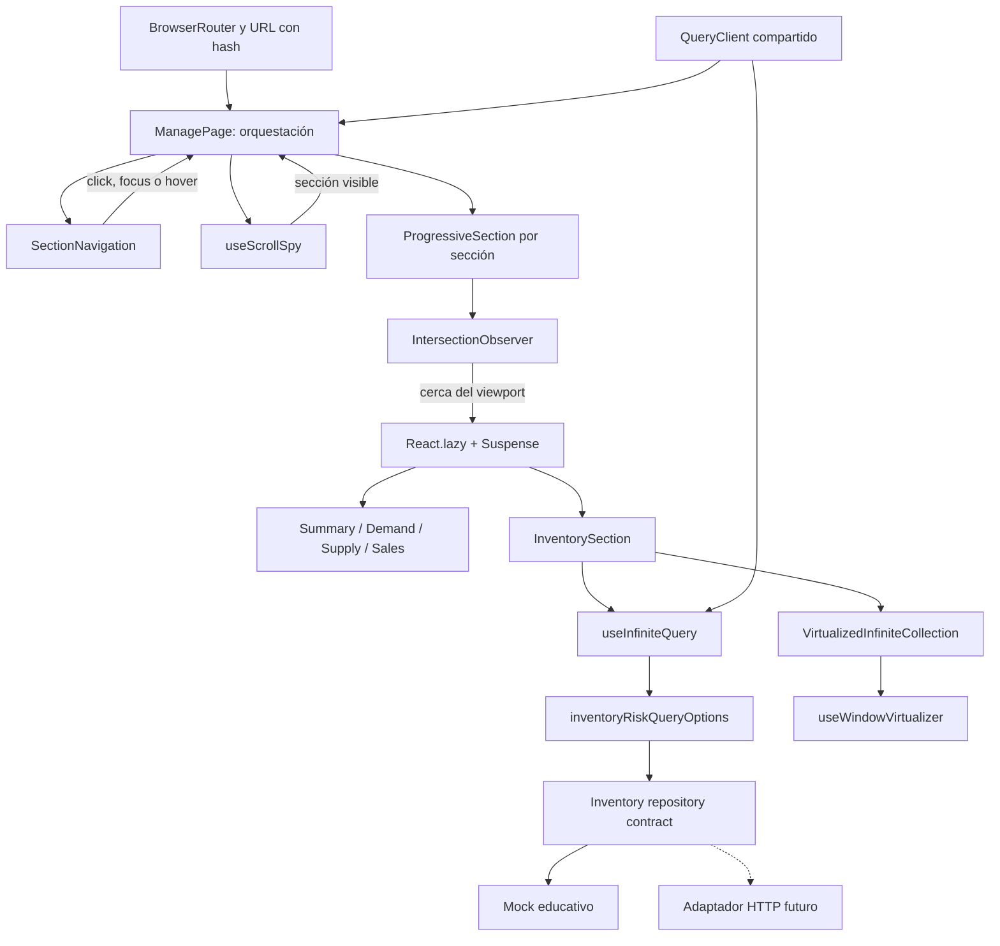
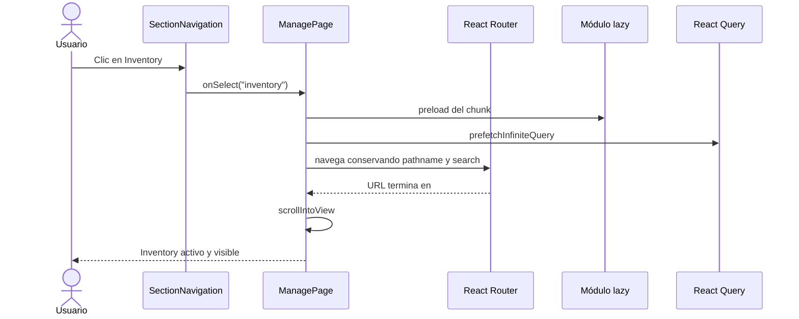

# Tutorial: navegación progresiva, lazy loading, infinite query y virtualización en React

> Guía de implementación para **React Progressive Dashboard**
>
> Nivel: principiante–intermedio
> Stack validado: Node.js 20.20.1, npm 10, React 19.1.0, Vite 6.4.3, TypeScript 5.7.3, React Router 7.16.0, Tailwind 3.4.19, Jest 30.4.2, ESLint 9.28.0 y TanStack React Query 5.81.5.

## Tabla de contenido

1. [Qué vamos a construir](#1-qué-vamos-a-construir)
2. [Decisiones de arquitectura](#2-decisiones-de-arquitectura)
3. [Preparar el scaffold](#3-preparar-el-scaffold)
4. [Configurar TanStack React Query](#4-configurar-tanstack-react-query)
5. [Crear el contrato paginado y el API mock](#5-crear-el-contrato-paginado-y-el-api-mock)
6. [Centralizar las opciones de la infinite query](#6-centralizar-las-opciones-de-la-infinite-query)
7. [Crear el componente genérico de virtualización](#7-crear-el-componente-genérico-de-virtualización)
8. [Crear las cinco secciones lazy](#8-crear-las-cinco-secciones-lazy)
9. [Definir el registro de secciones](#9-definir-el-registro-de-secciones)
10. [Activar secciones cerca del viewport](#10-activar-secciones-cerca-del-viewport)
11. [Crear la navegación y el scroll spy](#11-crear-la-navegación-y-el-scroll-spy)
12. [Orquestar la página Manage](#12-orquestar-la-página-manage)
13. [Conectar la ruta y terminar la interfaz](#13-conectar-la-ruta-y-terminar-la-interfaz)
14. [Pruebas automatizadas](#14-pruebas-automatizadas)
15. [Validación real en el navegador](#15-validación-real-en-el-navegador)
16. [Adaptación al backend real](#16-adaptación-al-backend-real)
17. [Errores comunes](#17-errores-comunes)
18. [Checklist de entrega](#18-checklist-de-entrega)
19. [Preguntas de repaso](#19-preguntas-de-repaso)

---

## 1. Qué vamos a construir

La página tendrá cinco enlaces:

- Summary
- Inventory
- Demand
- Supply
- Sales

Al abrir la página, **Summary** se muestra inmediatamente. Las otras secciones conservan un espacio estable en el documento, pero su JavaScript no se carga hasta que:

1. el usuario se acerca a la sección haciendo scroll;
2. enfoca o pasa el puntero sobre su enlace; o
3. hace clic en el enlace.

Cuando se hace clic, la aplicación:

1. precarga el módulo y sus datos si corresponde;
2. conserva el `pathname` y los parámetros de búsqueda actuales;
3. actualiza el hash, por ejemplo `#inventory`;
4. desplaza la página hacia la sección; y
5. marca el enlace como activo.

Inventory añade dos optimizaciones distintas:

- **Infinite query:** solicita los datos en páginas de 25 elementos.
- **Virtualización:** mantiene en el DOM solamente las filas visibles y unas pocas filas de margen.

### Tres conceptos que no deben confundirse

| Concepto | Qué evita | Herramienta |
|---|---|---|
| Lazy loading de código | Descargar JavaScript de secciones que todavía no se necesitan | `React.lazy` y `Suspense` |
| Carga paginada | Descargar todo el dataset en una sola petición | `useInfiniteQuery` |
| Virtualización | Crear cientos o miles de nodos DOM simultáneamente | `useWindowVirtualizer` |

Una página puede necesitar uno, dos o los tres. En este caso usamos los tres porque resuelven costos diferentes.

### Qué será genérico y qué será específico

`VirtualizedInfiniteCollection<T>` será genérico: no conocerá inventario, filtros ni React Query. Recibirá elementos, una función para renderizarlos y una función para pedir más.

La coordinación de hashes, tabs y secciones pertenece a `ManagePage`. Hacerla completamente genérica desde el primer día añadiría una API abstracta antes de conocer una segunda pantalla que la necesite. Si aparece otra vista con el mismo comportamiento, podremos extraer un `ProgressiveSectionPage` a partir de dos casos reales.

El repositorio de datos también queda detrás de un contrato. Así podremos sustituir el mock por HTTP sin modificar el componente virtualizado.

---

## 2. Decisiones de arquitectura



La regla central es: **los contenedores de las cinco secciones siempre existen en el documento**. Antes de activarse contienen un skeleton con una altura aproximada. Esto permite que `#sales`, por ejemplo, tenga un destino aunque el módulo Sales todavía no se haya descargado, y reduce saltos de layout.

Una sección activada nunca se “desactiva”. Descargarla, desmontarla al salir del viewport y descargarla otra vez produciría parpadeos, pérdida de estado local y trabajo innecesario.

### Flujo de un clic



---

## 3. Preparar el scaffold

### 3.1 Verificar las versiones

Desde la raíz del proyecto:

```bash
node --version
npm --version
```

La primera salida debe ser `v20.20.1`. La segunda debe comenzar con `10`.

El scaffold ya contiene `.nvmrc` y `.node-version`. Con `nvm` puedes seleccionar Node así:

```bash
nvm use
```

### 3.2 Corregir un carácter accidental en `package.json`

Antes de instalar nada, abre `package.json`. En el scaffold actual aparece:

```json
"typescript": "5.7.3",e    "typescript-eslint": "8.33.1",
```

Debe quedar:

```json
"typescript": "5.7.3",
"typescript-eslint": "8.33.1",
```

Ese carácter `e` hace que el JSON completo sea inválido. Si `npm` muestra `EJSONPARSE`, este es el primer lugar que debes revisar.

### 3.3 Instalar únicamente las dependencias necesarias

```bash
npm install @tanstack/react-query@5.81.5 @tanstack/react-virtual@3.14.6
npm install --save-dev @tanstack/react-query-devtools@5.81.5
```

No instalaremos Zustand, Axios ni Immer:

- React Query ya administra el estado del servidor.
- `fetch` es suficiente para el adaptador HTTP.
- Las actualizaciones de estado de este tutorial son pequeñas y legibles sin Immer.

React Virtual no formaba parte de la lista inicial, pero es la librería que implementa la virtualización solicitada. Su responsabilidad es diferente a la de React Query.

### 3.4 Crear las carpetas

```bash
mkdir -p src/app
mkdir -p src/components/virtualized-collection
mkdir -p src/features/inventory
mkdir -p src/pages/manage/sections
```

Al terminar, la estructura relevante será:

```text
src/
├── app/
│   └── queryClient.ts
├── components/
│   └── virtualized-collection/
│       └── VirtualizedInfiniteCollection.tsx
├── features/
│   └── inventory/
│       ├── inventoryQueryOptions.ts
│       └── inventoryRepository.ts
├── pages/
│   └── manage/
│       ├── ManagePage.tsx
│       ├── ProgressiveSection.tsx
│       ├── SectionErrorBoundary.tsx
│       ├── SectionNavigation.tsx
│       ├── SectionSkeleton.tsx
│       ├── manageSections.ts
│       ├── useScrollSpy.ts
│       └── sections/
│           ├── DemandSection.tsx
│           ├── InventorySection.tsx
│           ├── SalesSection.tsx
│           ├── SummarySection.tsx
│           └── SupplySection.tsx
├── App.tsx
├── index.css
└── main.tsx
```

### Checkpoint 1

```bash
npm run typecheck
npm run lint
npm test -- --runInBand
npm run build
```

No continúes si falla el scaffold original. Es mucho más fácil identificar un problema antes de añadir la funcionalidad.

---

## 4. Configurar TanStack React Query

React Query necesita un `QueryClient`. Este objeto contiene el caché, coordina peticiones repetidas y aplica opciones comunes.

Crea `src/app/queryClient.ts`:

```ts
import { QueryClient } from '@tanstack/react-query'

export function createQueryClient() {
  return new QueryClient({
    defaultOptions: {
      queries: {
        refetchOnWindowFocus: false,
        retry: 1,
        staleTime: 60_000,
      },
    },
  })
}

export const queryClient = createQueryClient()
```

Por qué estas opciones:

- `staleTime: 60_000`: durante un minuto, un dato cargado se considera fresco.
- `retry: 1`: un fallo transitorio obtiene un segundo intento, pero no ocultamos un problema persistente con muchos reintentos.
- `refetchOnWindowFocus: false`: facilita aprender y observar cuándo ocurre cada petición. En producción se puede reconsiderar por recurso.
- `createQueryClient()`: permite crear un cliente aislado por prueba.
- `queryClient`: es la instancia usada por la aplicación.

Ahora reemplaza `src/main.tsx`:

```tsx
import { QueryClientProvider } from '@tanstack/react-query'
import { ReactQueryDevtools } from '@tanstack/react-query-devtools'
import { StrictMode } from 'react'
import { createRoot } from 'react-dom/client'
import { BrowserRouter } from 'react-router'
import App from './App'
import { queryClient } from './app/queryClient'
import './index.css'

createRoot(document.getElementById('root')!).render(
  <StrictMode>
    <QueryClientProvider client={queryClient}>
      <BrowserRouter>
        <App />
      </BrowserRouter>
      {import.meta.env.DEV ? (
        <ReactQueryDevtools initialIsOpen={false} />
      ) : null}
    </QueryClientProvider>
  </StrictMode>,
)
```

Los Devtools se renderizan solamente cuando `import.meta.env.DEV` es verdadero. No mostramos ese panel en producción.

### Checkpoint 2

```bash
npm run typecheck
npm run lint
npm run dev
```

La aplicación existente debe seguir funcionando. En desarrollo aparecerá el botón de React Query Devtools; todavía no habrá queries.

---

## 5. Crear el contrato paginado y el API mock

La vista no debe saber si los datos vienen de un array, REST o GraphQL. Definiremos tipos de paginación y un repositorio con un método `list`.

Crea `src/features/inventory/inventoryRepository.ts`:

```ts
export type InventoryRisk = 'low' | 'medium' | 'high'

export type InventoryFilters = {
  risk: 'all' | InventoryRisk
  simulateError?: boolean
}

export type InventoryRiskItem = {
  id: string
  name: string
  onHand: number
  risk: InventoryRisk
  sku: string
}

export type PageRequest<TPageParam, TFilters> = {
  filters: TFilters
  pageParam: TPageParam
  pageSize: number
  signal: AbortSignal
}

export type PageResult<TItem, TPageParam> = {
  items: TItem[]
  nextPageParam: TPageParam | null
  total: number
}

export type InventoryCursor = string

const riskLevels: InventoryRisk[] = ['low', 'medium', 'high']

const inventoryItems: InventoryRiskItem[] = Array.from(
  { length: 1_000 },
  (_, index) => ({
    id: `inventory-${index + 1}`,
    name: `Product ${String(index + 1).padStart(4, '0')}`,
    onHand: (index * 37) % 500,
    risk: riskLevels[index % riskLevels.length]!,
    sku: `SKU-${String(index + 1).padStart(6, '0')}`,
  }),
)

function abortableDelay(milliseconds: number, signal: AbortSignal) {
  return new Promise<void>((resolve, reject) => {
    if (signal.aborted) {
      reject(new DOMException('The request was aborted.', 'AbortError'))
      return
    }

    const onAbort = () => {
      window.clearTimeout(timer)
      reject(new DOMException('The request was aborted.', 'AbortError'))
    }
    const timer = window.setTimeout(() => {
      signal.removeEventListener('abort', onAbort)
      resolve()
    }, milliseconds)

    signal.addEventListener('abort', onAbort, { once: true })
  })
}

export const inventoryRepository = {
  async list({
    filters,
    pageParam,
    pageSize,
    signal,
  }: PageRequest<InventoryCursor, InventoryFilters>): Promise<
    PageResult<InventoryRiskItem, InventoryCursor>
  > {
    await abortableDelay(350, signal)

    if (filters.simulateError) {
      throw new Error('The mock inventory service failed.')
    }

    const filteredItems =
      filters.risk === 'all'
        ? inventoryItems
        : inventoryItems.filter((item) => item.risk === filters.risk)
    const start = Number.parseInt(pageParam, 10)
    const safeStart = Number.isNaN(start) ? 0 : start
    const end = Math.min(safeStart + pageSize, filteredItems.length)

    return {
      items: filteredItems.slice(safeStart, end),
      nextPageParam: end < filteredItems.length ? String(end) : null,
      total: filteredItems.length,
    }
  },
}
```

### Qué estamos aprendiendo aquí

`PageRequest<TPageParam, TFilters>` y `PageResult<TItem, TPageParam>` son genéricos. El cursor de otro endpoint podría ser un token opaco en vez de un índice.

Usamos un **cursor inicial string**, `'0'`, no `null`. En TanStack Query v5 `initialPageParam` es obligatorio. Mantener un tipo estable evita que TypeScript infiera accidentalmente que todos los cursores son `null`.

React Query entrega un `AbortSignal` a la función de consulta. El mock lo respeta, igual que deberá hacerlo `fetch` en el adaptador real. Esto evita trabajo innecesario cuando una consulta deja de ser relevante.

Este mock es solamente educativo:

- genera 1,000 productos en memoria;
- simula 350 ms de red;
- usa un índice serializado como cursor;
- permite provocar un error.

No copies la conversión `Number.parseInt(pageParam, 10)` al backend real si este entrega cursores opacos.

### Checkpoint 3

```bash
npm run typecheck
npm run lint
```

Todavía no hay cambios visuales. El propósito de este checkpoint es validar el límite de datos por separado.

---

## 6. Centralizar las opciones de la infinite query

La pantalla y el prefetch deben usar exactamente la misma `queryKey`, la misma función y el mismo tamaño de página. Una factoría de opciones compartida elimina duplicación.

Crea `src/features/inventory/inventoryQueryOptions.ts`:

```ts
import { infiniteQueryOptions } from '@tanstack/react-query'
import {
  type InventoryFilters,
  inventoryRepository,
} from './inventoryRepository'

export const defaultInventoryFilters: InventoryFilters = {
  risk: 'all',
}

export function inventoryRiskQueryOptions(filters: InventoryFilters) {
  const normalizedFilters: InventoryFilters = {
    risk: filters.risk,
    simulateError: Boolean(filters.simulateError),
  }

  return infiniteQueryOptions({
    queryKey: ['manage', 'inventory', 'risks', normalizedFilters] as const,
    queryFn: ({ pageParam, signal }) =>
      inventoryRepository.list({
        filters: normalizedFilters,
        pageParam,
        pageSize: 25,
        signal,
      }),
    initialPageParam: '0',
    getNextPageParam: (lastPage) =>
      lastPage.nextPageParam ?? undefined,
    staleTime: 60_000,
  })
}
```

La `queryKey` es la identidad del dato. Los filtros forman parte de ella porque “todos los riesgos” y “riesgo alto” son resultados distintos.

`getNextPageParam` convierte el `null` del contrato del repositorio a `undefined`. Para React Query, `undefined` significa “no hay otra página”.

Más adelante usaremos esta misma función en dos lugares:

```ts
useInfiniteQuery(inventoryRiskQueryOptions(filters))
```

y:

```ts
queryClient.prefetchInfiniteQuery(
  inventoryRiskQueryOptions(defaultInventoryFilters),
)
```

Gracias a la clave compartida, el prefetch llena el mismo caché que consumirá Inventory.

### Checkpoint 4

```bash
npm run typecheck
npm run lint
```

---

## 7. Crear el componente genérico de virtualización

Una lista virtual representa la altura completa de los datos con un contenedor grande, pero monta únicamente los elementos cercanos al viewport.

Usaremos el scroll de la ventana porque toda la página Manage se desplaza como un documento. Si en el diseño real Inventory vive dentro de un panel con scroll propio, se debe cambiar a `useVirtualizer` y proporcionar `getScrollElement`.

Crea `src/components/virtualized-collection/VirtualizedInfiniteCollection.tsx`:

```tsx
import { useWindowVirtualizer } from '@tanstack/react-virtual'
import {
  type Key,
  type ReactNode,
  useEffect,
  useLayoutEffect,
  useRef,
  useState,
} from 'react'

export type VirtualizedInfiniteCollectionProps<T> = {
  emptyState: ReactNode
  estimateSize: (index: number) => number
  getItemKey: (item: T) => Key
  hasNextPage: boolean
  isFetchingNextPage: boolean
  items: readonly T[]
  onLoadMore: () => Promise<unknown>
  overscan?: number
  renderItem: (item: T, index: number) => ReactNode
}

export function VirtualizedInfiniteCollection<T>({
  emptyState,
  estimateSize,
  getItemKey,
  hasNextPage,
  isFetchingNextPage,
  items,
  onLoadMore,
  overscan = 6,
  renderItem,
}: VirtualizedInfiniteCollectionProps<T>) {
  const listRef = useRef<HTMLDivElement>(null)
  const [scrollMargin, setScrollMargin] = useState(0)

  useLayoutEffect(() => {
    let animationFrame = 0

    const updateScrollMargin = () => {
      window.cancelAnimationFrame(animationFrame)
      animationFrame = window.requestAnimationFrame(() => {
        const list = listRef.current
        if (list) {
          setScrollMargin(
            list.getBoundingClientRect().top + window.scrollY,
          )
        }
      })
    }

    updateScrollMargin()
    const resizeObserver = new ResizeObserver(updateScrollMargin)
    resizeObserver.observe(document.body)
    window.addEventListener('resize', updateScrollMargin)

    return () => {
      window.cancelAnimationFrame(animationFrame)
      resizeObserver.disconnect()
      window.removeEventListener('resize', updateScrollMargin)
    }
  }, [])

  const loaderIndex = items.length
  const virtualizer = useWindowVirtualizer<HTMLDivElement>({
    count: items.length + (hasNextPage ? 1 : 0),
    estimateSize: (index) =>
      index === loaderIndex ? 72 : estimateSize(index),
    getItemKey: (index) =>
      index === loaderIndex ? '__loader__' : getItemKey(items[index]!),
    overscan,
    scrollMargin,
  })
  const virtualItems = virtualizer.getVirtualItems()
  const lastVirtualIndex = virtualItems.at(-1)?.index ?? -1

  useEffect(() => {
    if (
      lastVirtualIndex >= Math.max(0, items.length - 5) &&
      hasNextPage &&
      !isFetchingNextPage
    ) {
      void onLoadMore()
    }
  }, [
    hasNextPage,
    isFetchingNextPage,
    items.length,
    lastVirtualIndex,
    onLoadMore,
  ])

  if (items.length === 0 && !hasNextPage) {
    return <>{emptyState}</>
  }

  return (
    <div ref={listRef}>
      <div
        className="relative w-full"
        style={{ height: `${virtualizer.getTotalSize()}px` }}
      >
        {virtualItems.map((virtualItem) => {
          const isLoader = virtualItem.index === loaderIndex

          return (
            <div
              key={virtualItem.key}
              ref={virtualizer.measureElement}
              data-index={virtualItem.index}
              className="absolute left-0 top-0 w-full pb-3"
              style={{
                transform: `translateY(${
                  virtualItem.start -
                  virtualizer.options.scrollMargin
                }px)`,
              }}
            >
              {isLoader ? (
                <div className="flex min-h-[4rem] items-center justify-center">
                  <button
                    type="button"
                    disabled={isFetchingNextPage}
                    onClick={() => void onLoadMore()}
                    className="rounded-md border border-slate-300 bg-white px-4 py-2 text-sm font-medium disabled:opacity-60"
                  >
                    {isFetchingNextPage ? 'Loading more…' : 'Load more'}
                  </button>
                </div>
              ) : (
                renderItem(items[virtualItem.index]!, virtualItem.index)
              )}
            </div>
          )
        })}
      </div>
    </div>
  )
}
```

### Las partes difíciles

#### `scrollMargin`

`useWindowVirtualizer` calcula posiciones relativas a la ventana. Nuestra lista comienza después de Summary y del encabezado. Por eso calculamos:

```ts
list.getBoundingClientRect().top + window.scrollY
```

El primer término es la posición actual con respecto al viewport; el segundo la convierte en posición dentro del documento.

La altura de las secciones anteriores puede cambiar cuando terminan de cargar. Un `ResizeObserver` sobre `document.body`, junto al evento `resize`, recalcula el margen. `requestAnimationFrame` agrupa mediciones repetidas en un solo frame.

Al transformar cada fila hay que restar el margen:

```ts
virtualItem.start - virtualizer.options.scrollMargin
```

Omitir esa resta desplaza las filas varios cientos de píxeles.

#### Medición dinámica

`estimateSize` permite pintar antes de conocer la altura exacta. `ref={virtualizer.measureElement}` mide cada elemento ya renderizado y corrige el cálculo. `data-index` permite asociar el nodo medido con su índice.

#### Fila cargadora

Cuando hay otra página, `count` incluye una posición adicional. Esa posición dispara la carga automática cerca del final y también ofrece un botón accesible como alternativa.

#### `overscan`

Renderizamos seis elementos fuera del viewport. Un valor muy pequeño puede revelar espacios durante un scroll rápido; uno demasiado grande reduce el beneficio de virtualizar. Debe medirse con el contenido real.

### Checkpoint 5

```bash
npm run typecheck
npm run lint
```

El componente todavía no se ve porque ninguna pantalla lo consume.

---

## 8. Crear las cinco secciones lazy

Cada archivo tendrá un `export default`. Esto es importante porque `React.lazy` espera que la promesa del `import()` resuelva a un módulo con una propiedad `default`.

### 8.1 Summary

Crea `src/pages/manage/sections/SummarySection.tsx`:

```tsx
export default function SummarySection() {
  return (
    <div>
      <h1
        id="summary-heading"
        className="text-4xl font-bold text-slate-950"
      >
        Competitor recall opens supply gap
      </h1>
      <p className="mt-3 max-w-2xl text-slate-600">
        Summary loads immediately. The remaining sections are split into
        separate chunks and activate progressively.
      </p>

      <div className="mt-8 grid gap-4 md:grid-cols-3">
        {[
          ['$1.16M', 'Total sales YTD'],
          ['82%', 'On-time in-full'],
          ['28/30', 'Average days on hand'],
        ].map(([value, label]) => (
          <article
            key={label}
            className="rounded-xl border bg-white p-6 shadow-sm"
          >
            <p className="text-3xl font-bold">{value}</p>
            <p className="mt-2 text-sm text-slate-500">{label}</p>
          </article>
        ))}
      </div>

      <div className="mt-8 h-[520px] rounded-xl border bg-white p-6 shadow-sm">
        <h2 className="text-xl font-semibold">OTIF performance</h2>
        <div className="mt-6 h-[420px] rounded-lg bg-gradient-to-b from-slate-100 to-slate-50" />
      </div>
    </div>
  )
}
```

### 8.2 Inventory

Crea `src/pages/manage/sections/InventorySection.tsx`:

```tsx
import { useInfiniteQuery } from '@tanstack/react-query'
import { useCallback, useMemo, useState } from 'react'
import { VirtualizedInfiniteCollection } from '../../../components/virtualized-collection/VirtualizedInfiniteCollection'
import {
  defaultInventoryFilters,
  inventoryRiskQueryOptions,
} from '../../../features/inventory/inventoryQueryOptions'
import type {
  InventoryFilters,
  InventoryRiskItem,
} from '../../../features/inventory/inventoryRepository'

function InventoryRiskCard({ item }: { item: InventoryRiskItem }) {
  return (
    <article className="rounded-xl border border-slate-200 bg-white p-5 shadow-sm">
      <div className="flex items-start justify-between gap-4">
        <div>
          <p className="text-xs font-semibold uppercase tracking-wide text-slate-500">
            {item.sku}
          </p>
          <h3 className="mt-1 font-semibold text-slate-950">
            {item.name}
          </h3>
        </div>
        <span className="rounded-full bg-slate-100 px-3 py-1 text-xs font-medium capitalize text-slate-700">
          {item.risk} risk
        </span>
      </div>
      <p className="mt-4 text-sm text-slate-600">
        On hand: {item.onHand} units
      </p>
    </article>
  )
}

export default function InventorySection() {
  const [filters, setFilters] = useState<InventoryFilters>(
    defaultInventoryFilters,
  )
  const query = useInfiniteQuery(inventoryRiskQueryOptions(filters))
  const items = useMemo(
    () => query.data?.pages.flatMap((page) => page.items) ?? [],
    [query.data],
  )
  const loadMore = useCallback(
    () => query.fetchNextPage({ cancelRefetch: false }),
    [query.fetchNextPage],
  )

  if (query.isPending) {
    return <p aria-live="polite">Loading inventory…</p>
  }

  if (query.isError) {
    return (
      <div
        role="alert"
        className="rounded-xl border border-red-200 bg-red-50 p-5"
      >
        <p>Inventory could not be loaded: {query.error.message}</p>
        <button
          type="button"
          onClick={() => void query.refetch()}
          className="mt-3 rounded-md bg-red-700 px-4 py-2 text-white"
        >
          Try again
        </button>
      </div>
    )
  }

  return (
    <div>
      <div className="mb-6 flex flex-wrap items-end justify-between gap-4">
        <div>
          <h2
            id="inventory-heading"
            className="text-3xl font-bold text-slate-950"
          >
            Inventory
          </h2>
          <p className="mt-2 text-slate-600">
            {query.data.pages[0]?.total ?? 0} matching products
          </p>
        </div>

        <label className="text-sm font-medium text-slate-700">
          Risk
          <select
            value={filters.risk}
            onChange={(event) =>
              setFilters({
                risk: event.target.value as InventoryFilters['risk'],
              })
            }
            className="ml-2 rounded-md border border-slate-300 bg-white px-3 py-2"
          >
            <option value="all">All</option>
            <option value="high">High</option>
            <option value="medium">Medium</option>
            <option value="low">Low</option>
          </select>
        </label>
      </div>

      <VirtualizedInfiniteCollection
        items={items}
        getItemKey={(item) => item.id}
        estimateSize={() => 132}
        renderItem={(item) => <InventoryRiskCard item={item} />}
        hasNextPage={
          query.hasNextPage && !query.isFetchNextPageError
        }
        isFetchingNextPage={query.isFetchingNextPage}
        onLoadMore={loadMore}
        emptyState={<p>No inventory items match this filter.</p>}
      />

      {query.isFetchNextPageError ? (
        <div role="alert" className="mt-4 text-sm text-red-700">
          The next page failed. Your loaded items are still available.
          <button
            type="button"
            onClick={() => void loadMore()}
            className="ml-2 underline"
          >
            Retry
          </button>
        </div>
      ) : null}
    </div>
  )
}
```

Observa la diferencia entre los estados:

- `isPending`: todavía no existe ninguna página.
- `isError`: la primera página falló y no hay contenido que mostrar.
- `isFetchingNextPage`: conservamos el contenido anterior mientras llega otra página.
- `isFetchNextPageError`: conservamos lo ya cargado y mostramos un reintento específico.

`cancelRefetch: false` evita que clics o detecciones repetidas durante una petición en progreso cancelen esa petición e inicien otra. También retiramos temporalmente la fila automática cuando falla una página; así no creamos un ciclo de reintentos infinito. El botón `Retry` sigue disponible.

Al cambiar `filters.risk`, cambia la `queryKey`. React Query busca o crea una entrada de caché independiente y la lista recibe el nuevo conjunto de páginas.

### 8.3 Demand

Crea `src/pages/manage/sections/DemandSection.tsx`:

```tsx
export default function DemandSection() {
  return (
    <div>
      <h2
        id="demand-heading"
        className="text-3xl font-bold text-slate-950"
      >
        Demand
      </h2>
      <p className="mt-2 text-slate-600">
        Demand signals loaded lazily.
      </p>
      <div className="mt-6 h-[760px] rounded-xl border bg-white shadow-sm" />
    </div>
  )
}
```

### 8.4 Supply

Crea `src/pages/manage/sections/SupplySection.tsx`:

```tsx
export default function SupplySection() {
  return (
    <div>
      <h2
        id="supply-heading"
        className="text-3xl font-bold text-slate-950"
      >
        Supply
      </h2>
      <p className="mt-2 text-slate-600">
        Supply recommendations loaded lazily.
      </p>
      <div className="mt-6 h-[720px] rounded-xl border bg-white shadow-sm" />
    </div>
  )
}
```

### 8.5 Sales

Crea `src/pages/manage/sections/SalesSection.tsx`:

```tsx
export default function SalesSection() {
  return (
    <div>
      <h2
        id="sales-heading"
        className="text-3xl font-bold text-slate-950"
      >
        Sales
      </h2>
      <p className="mt-2 text-slate-600">
        Sales opportunities loaded lazily.
      </p>
      <div className="mt-6 h-[780px] rounded-xl border bg-white shadow-sm" />
    </div>
  )
}
```

Las alturas grandes son contenido provisional para reproducir el comportamiento del prototipo. En la aplicación real se reemplazan por gráficos, tablas y cards, pero los encabezados y sus `id` deben permanecer.

### Checkpoint 6

```bash
npm run typecheck
npm run lint
```

---

## 9. Definir el registro de secciones

En vez de repetir cinco veces la relación entre `id`, etiqueta, import y altura, crearemos una configuración tipada.

Crea `src/pages/manage/manageSections.ts`:

```tsx
import { lazy, type ComponentType, type LazyExoticComponent } from 'react'

export type ManageSectionId =
  | 'summary'
  | 'inventory'
  | 'demand'
  | 'supply'
  | 'sales'

type SectionModule = {
  default: ComponentType
}

export type ManageSectionDefinition = {
  Component: LazyExoticComponent<ComponentType>
  id: ManageSectionId
  label: string
  load: () => Promise<SectionModule>
  placeholderMinHeight: number
}

const loadSummary = () => import('./sections/SummarySection')
const loadInventory = () => import('./sections/InventorySection')
const loadDemand = () => import('./sections/DemandSection')
const loadSupply = () => import('./sections/SupplySection')
const loadSales = () => import('./sections/SalesSection')

export const manageSections: ManageSectionDefinition[] = [
  {
    id: 'summary',
    label: 'Summary',
    placeholderMinHeight: 820,
    load: loadSummary,
    Component: lazy(loadSummary),
  },
  {
    id: 'inventory',
    label: 'Inventory',
    placeholderMinHeight: 900,
    load: loadInventory,
    Component: lazy(loadInventory),
  },
  {
    id: 'demand',
    label: 'Demand',
    placeholderMinHeight: 900,
    load: loadDemand,
    Component: lazy(loadDemand),
  },
  {
    id: 'supply',
    label: 'Supply',
    placeholderMinHeight: 860,
    load: loadSupply,
    Component: lazy(loadSupply),
  },
  {
    id: 'sales',
    label: 'Sales',
    placeholderMinHeight: 920,
    load: loadSales,
    Component: lazy(loadSales),
  },
]

const sectionIds = new Set(manageSections.map((section) => section.id))

export function isManageSectionId(value: string): value is ManageSectionId {
  return sectionIds.has(value as ManageSectionId)
}

export function getSectionIdFromHash(hash: string): ManageSectionId {
  const value = decodeURIComponent(hash.replace(/^#/, ''))
  return isManageSectionId(value) ? value : 'summary'
}
```

Guardar la función de importación como `load` permite comenzar a descargar el chunk cuando hay intención del usuario. Pasar la misma función a `lazy` permite a React renderizarlo cuando la sección se activa. Los imports dinámicos quedan en chunks independientes durante el build.

`getSectionIdFromHash` no confía ciegamente en la URL. Un hash vacío o desconocido vuelve a Summary.

---

## 10. Activar secciones cerca del viewport

Primero crea el skeleton en `src/pages/manage/SectionSkeleton.tsx`:

```tsx
export function SectionSkeleton({
  label,
  minHeight,
}: {
  label: string
  minHeight: number
}) {
  return (
    <div
      aria-busy="true"
      aria-label={`Loading ${label}`}
      className="animate-pulse rounded-xl border border-slate-200 bg-white p-6"
      style={{ minHeight }}
    >
      <div className="h-8 w-48 rounded bg-slate-200" />
      <div className="mt-6 grid gap-4 md:grid-cols-3">
        <div className="h-32 rounded bg-slate-100" />
        <div className="h-32 rounded bg-slate-100" />
        <div className="h-32 rounded bg-slate-100" />
      </div>
      <span className="sr-only">Loading {label}</span>
    </div>
  )
}
```

Ahora crea un límite de error por sección en `src/pages/manage/SectionErrorBoundary.tsx`:

```tsx
import { Component, type ErrorInfo, type ReactNode } from 'react'

type Props = {
  children: ReactNode
  label: string
}

type State = {
  error: Error | null
}

export class SectionErrorBoundary extends Component<Props, State> {
  state: State = { error: null }

  static getDerivedStateFromError(error: Error): State {
    return { error }
  }

  componentDidCatch(error: Error, info: ErrorInfo) {
    console.error(
      'A progressive section failed to render.',
      error,
      info,
    )
  }

  render() {
    if (this.state.error) {
      return (
        <div
          role="alert"
          className="rounded-xl border border-red-200 bg-red-50 p-6 text-red-800"
        >
          <h2 className="font-semibold">
            {this.props.label} could not be opened.
          </h2>
          <p className="mt-2 text-sm">{this.state.error.message}</p>
          <button
            type="button"
            onClick={() => window.location.reload()}
            className="mt-4 rounded-md bg-red-700 px-4 py-2 text-sm font-medium text-white"
          >
            Reload the page
          </button>
        </div>
      )
    }

    return this.props.children
  }
}
```

Un error descargando Demand no debe tumbar Summary, Inventory y el resto de la página. Por eso cada sección obtiene su propio límite.

Crea `src/pages/manage/ProgressiveSection.tsx`:

```tsx
import {
  Suspense,
  useCallback,
  useEffect,
  useRef,
  type RefCallback,
} from 'react'
import type {
  ManageSectionDefinition,
  ManageSectionId,
} from './manageSections'
import { SectionErrorBoundary } from './SectionErrorBoundary'
import { SectionSkeleton } from './SectionSkeleton'

type Props = {
  activated: boolean
  definition: ManageSectionDefinition
  onActivate: (id: ManageSectionId) => void
  registerNode: (
    id: ManageSectionId,
    node: HTMLElement | null,
  ) => void
}

export function ProgressiveSection({
  activated,
  definition,
  onActivate,
  registerNode,
}: Props) {
  const nodeRef = useRef<HTMLElement | null>(null)
  const { Component, id, label, load, placeholderMinHeight } = definition

  const setNode: RefCallback<HTMLElement> = useCallback(
    (node) => {
      nodeRef.current = node
      registerNode(id, node)
    },
    [id, registerNode],
  )

  useEffect(() => {
    const node = nodeRef.current
    if (activated || !node) return

    const observer = new IntersectionObserver(
      ([entry]) => {
        if (entry?.isIntersecting) {
          void load().catch(() => undefined)
          onActivate(id)
          observer.disconnect()
        }
      },
      {
        root: null,
        rootMargin: '800px 0px',
        threshold: 0,
      },
    )

    observer.observe(node)
    return () => observer.disconnect()
  }, [activated, id, load, onActivate])

  return (
    <section
      ref={setNode}
      id={id}
      aria-label={activated ? undefined : label}
      aria-labelledby={activated ? `${id}-heading` : undefined}
      className="scroll-mt-20 px-6 py-12"
      style={
        activated ? undefined : { minHeight: placeholderMinHeight }
      }
    >
      {activated ? (
        <SectionErrorBoundary label={label}>
          <Suspense
            fallback={
              <SectionSkeleton
                label={label}
                minHeight={placeholderMinHeight}
              />
            }
          >
            <Component />
          </Suspense>
        </SectionErrorBoundary>
      ) : (
        <SectionSkeleton
          label={label}
          minHeight={placeholderMinHeight}
        />
      )}
    </section>
  )
}
```

`rootMargin: '800px 0px'` activa una sección antes de que sea visible. Así la descarga puede terminar antes de que el usuario llegue. Ajusta 800 px después de medir el tamaño de chunks, la latencia habitual y la velocidad de scroll.

El contenedor `<section id="...">` existe incluso desactivado. Esto hace confiables los hashes y el `scrollIntoView`.

### Checkpoint 7

```bash
npm run typecheck
npm run lint
```

---

## 11. Crear la navegación y el scroll spy

### 11.1 Navegación accesible

Crea `src/pages/manage/SectionNavigation.tsx`:

```tsx
import type { MouseEvent } from 'react'
import type {
  ManageSectionDefinition,
  ManageSectionId,
} from './manageSections'

type Props = {
  activeId: ManageSectionId
  onIntent: (id: ManageSectionId) => void
  onSelect: (
    id: ManageSectionId,
    event: MouseEvent<HTMLAnchorElement>,
  ) => void
  sections: readonly ManageSectionDefinition[]
}

export function SectionNavigation({
  activeId,
  onIntent,
  onSelect,
  sections,
}: Props) {
  return (
    <nav
      aria-label="Manage sections"
      className="sticky top-0 z-20 border-b border-slate-200 bg-white/95 px-6 backdrop-blur"
    >
      <div className="mx-auto flex h-16 max-w-6xl items-center gap-6 overflow-x-auto">
        {sections.map((section) => {
          const active = section.id === activeId

          return (
            <a
              key={section.id}
              href={`#${section.id}`}
              aria-current={active ? 'location' : undefined}
              onClick={(event) => onSelect(section.id, event)}
              onFocus={() => onIntent(section.id)}
              onPointerEnter={() => onIntent(section.id)}
              className={[
                'flex h-full items-center border-b-2 text-sm font-medium transition-colors',
                active
                  ? 'border-violet-600 text-violet-700'
                  : 'border-transparent text-slate-500 hover:text-slate-950',
              ].join(' ')}
            >
              {section.label}
            </a>
          )
        })}
      </div>
    </nav>
  )
}
```

Usamos enlaces reales con `href`. Aunque JavaScript intercepte el clic para coordinar la transición, el enlace conserva semántica, aparece en el orden del teclado y tiene un destino comprensible.

`aria-current="location"` comunica el estado activo a tecnologías de asistencia. El borde y el color lo comunican visualmente.

`onFocus` sirve a usuarios de teclado y `onPointerEnter` al puntero. Ambos comienzan el preload, pero no activan ni desplazan la sección.

### 11.2 Scroll spy

Crea `src/pages/manage/useScrollSpy.ts`:

```ts
import {
  type Dispatch,
  type SetStateAction,
  useEffect,
  useState,
} from 'react'
import type { ManageSectionId } from './manageSections'

export function useScrollSpy(
  ids: readonly ManageSectionId[],
  nodes: Map<ManageSectionId, HTMLElement>,
  registrationVersion: number,
  initialId: ManageSectionId,
): [
  ManageSectionId,
  Dispatch<SetStateAction<ManageSectionId>>,
] {
  const [activeId, setActiveId] =
    useState<ManageSectionId>(initialId)

  useEffect(() => {
    if (nodes.size === 0) return

    const entriesById =
      new Map<ManageSectionId, IntersectionObserverEntry>()
    const observer = new IntersectionObserver(
      (entries) => {
        for (const entry of entries) {
          entriesById.set(
            entry.target.id as ManageSectionId,
            entry,
          )
        }

        const visibleEntries = ids
          .map((id) => entriesById.get(id))
          .filter(
            (entry): entry is IntersectionObserverEntry =>
              Boolean(entry?.isIntersecting),
          )
          .sort(
            (left, right) =>
              Math.abs(left.boundingClientRect.top - 72) -
              Math.abs(right.boundingClientRect.top - 72),
          )

        const nextId = visibleEntries[0]?.target.id
        if (nextId) {
          setActiveId(nextId as ManageSectionId)
        }
      },
      {
        root: null,
        rootMargin: '-72px 0px -60% 0px',
        threshold: [0, 0.01, 0.25, 0.5, 0.75],
      },
    )

    for (const node of nodes.values()) {
      observer.observe(node)
    }

    return () => observer.disconnect()
  }, [ids, nodes, registrationVersion])

  return [activeId, setActiveId]
}
```

El hook observa todos los contenedores. Entre los visibles escoge el más cercano a 72 px desde el borde superior, inmediatamente debajo de la navegación sticky.

`registrationVersion` existe porque mutar un `Map` dentro de un ref no produce un render. ManagePage incrementará ese contador al registrar o retirar un nodo, y el efecto volverá a conectar el observer.

El array `ids` se definirá fuera del componente de página, por lo que su identidad será estable.

---

## 12. Orquestar la página Manage

Crea `src/pages/manage/ManagePage.tsx`:

```tsx
import { useQueryClient } from '@tanstack/react-query'
import {
  useCallback,
  useEffect,
  useMemo,
  useRef,
  useState,
  type MouseEvent,
} from 'react'
import {
  useLocation,
  useNavigate,
  useNavigationType,
} from 'react-router'
import {
  defaultInventoryFilters,
  inventoryRiskQueryOptions,
} from '../../features/inventory/inventoryQueryOptions'
import {
  getSectionIdFromHash,
  manageSections,
  type ManageSectionId,
} from './manageSections'
import { ProgressiveSection } from './ProgressiveSection'
import { SectionNavigation } from './SectionNavigation'
import { useScrollSpy } from './useScrollSpy'

const manageSectionIds = manageSections.map((section) => section.id)

export default function ManagePage() {
  const location = useLocation()
  const navigate = useNavigate()
  const navigationType = useNavigationType()
  const queryClient = useQueryClient()
  const initialId = useMemo(
    () => getSectionIdFromHash(location.hash),
    [location.hash],
  )
  const [activatedIds, setActivatedIds] = useState<
    Set<ManageSectionId>
  >(() => new Set<ManageSectionId>(['summary', initialId]))
  const sectionNodes =
    useRef(new Map<ManageSectionId, HTMLElement>())
  const [registrationVersion, setRegistrationVersion] = useState(0)
  const programmaticTarget = useRef<ManageSectionId | null>(null)
  const suppressionTimer = useRef<number | null>(null)

  const registerNode = useCallback(
    (id: ManageSectionId, node: HTMLElement | null) => {
      const previous = sectionNodes.current.get(id)

      if (node && previous !== node) {
        sectionNodes.current.set(id, node)
        setRegistrationVersion((version) => version + 1)
      } else if (!node && previous) {
        sectionNodes.current.delete(id)
        setRegistrationVersion((version) => version + 1)
      }
    },
    [],
  )

  const activateSection = useCallback((id: ManageSectionId) => {
    setActivatedIds((current) => {
      if (current.has(id)) return current

      const next = new Set(current)
      next.add(id)
      return next
    })
  }, [])

  const preloadSection = useCallback(
    (id: ManageSectionId) => {
      const definition = manageSections.find(
        (section) => section.id === id,
      )
      void definition?.load().catch(() => undefined)

      if (id === 'inventory') {
        void queryClient.prefetchInfiniteQuery(
          inventoryRiskQueryOptions(defaultInventoryFilters),
        )
      }
    },
    [queryClient],
  )

  const [activeId, setActiveId] = useScrollSpy(
    manageSectionIds,
    sectionNodes.current,
    registrationVersion,
    initialId,
  )

  const suppressPassiveHashUpdates = useCallback(
    (target: ManageSectionId) => {
      programmaticTarget.current = target

      if (suppressionTimer.current !== null) {
        window.clearTimeout(suppressionTimer.current)
      }

      suppressionTimer.current = window.setTimeout(() => {
        programmaticTarget.current = null
        suppressionTimer.current = null
      }, 1_200)
    },
    [],
  )

  const scrollToSection = useCallback(
    (id: ManageSectionId, behavior: ScrollBehavior) => {
      window.requestAnimationFrame(() => {
        sectionNodes.current.get(id)?.scrollIntoView({
          behavior,
          block: 'start',
        })
      })
    },
    [],
  )

  const handleSelect = useCallback(
    (
      id: ManageSectionId,
      event: MouseEvent<HTMLAnchorElement>,
    ) => {
      event.preventDefault()
      activateSection(id)
      preloadSection(id)
      setActiveId(id)
      suppressPassiveHashUpdates(id)

      navigate(
        {
          pathname: location.pathname,
          search: location.search,
          hash: `#${id}`,
        },
        { preventScrollReset: true },
      )

      const reducedMotion = window.matchMedia(
        '(prefers-reduced-motion: reduce)',
      ).matches
      scrollToSection(id, reducedMotion ? 'auto' : 'smooth')
    },
    [
      activateSection,
      location.pathname,
      location.search,
      navigate,
      preloadSection,
      scrollToSection,
      setActiveId,
      suppressPassiveHashUpdates,
    ],
  )

  useEffect(() => {
    if (
      navigationType !== 'POP' ||
      sectionNodes.current.size !== manageSections.length
    ) {
      return
    }

    const id = getSectionIdFromHash(location.hash)
    activateSection(id)
    preloadSection(id)
    setActiveId(id)
    suppressPassiveHashUpdates(id)
    scrollToSection(id, 'auto')
  }, [
    activateSection,
    location.hash,
    location.key,
    navigationType,
    preloadSection,
    registrationVersion,
    scrollToSection,
    setActiveId,
    suppressPassiveHashUpdates,
  ])

  useEffect(() => {
    activateSection(activeId)

    const activeIndex = manageSectionIds.indexOf(activeId)
    const nextId = manageSectionIds[activeIndex + 1]
    if (nextId) preloadSection(nextId)

    if (
      programmaticTarget.current === null &&
      location.hash !== `#${activeId}`
    ) {
      navigate(
        {
          pathname: location.pathname,
          search: location.search,
          hash: `#${activeId}`,
        },
        {
          preventScrollReset: true,
          replace: true,
        },
      )
    }
  }, [
    activateSection,
    activeId,
    location.hash,
    location.pathname,
    location.search,
    navigate,
    preloadSection,
  ])

  useEffect(
    () => () => {
      if (suppressionTimer.current !== null) {
        window.clearTimeout(suppressionTimer.current)
      }
    },
    [],
  )

  return (
    <div className="min-h-screen bg-slate-50">
      <SectionNavigation
        sections={manageSections}
        activeId={activeId}
        onIntent={preloadSection}
        onSelect={handleSelect}
      />

      <main className="mx-auto max-w-6xl">
        {manageSections.map((definition) => (
          <ProgressiveSection
            key={definition.id}
            definition={definition}
            activated={activatedIds.has(definition.id)}
            onActivate={activateSection}
            registerNode={registerNode}
          />
        ))}
      </main>
    </div>
  )
}
```

### Leer el código por responsabilidades

#### Estado de activación

`activatedIds` comienza con Summary y con la sección indicada en el hash. Es un `Set` porque una sección puede activarse una sola vez; nunca eliminamos ids.

#### Prefetch coordinado

`preloadSection` descarga el chunk. Para Inventory también precarga la primera página usando la factoría de opciones compartida. Si el usuario llega después, `useInfiniteQuery` reutiliza ese dato.

#### Historia del navegador

- Un clic usa `navigate` sin `replace`: crea una entrada para que Back pueda regresar.
- El scroll pasivo usa `replace: true`: actualiza el enlace compartible sin llenar la historia con cada sección atravesada.
- `useNavigationType() === 'POP'` identifica Back, Forward y la carga inicial. Entonces se reactiva y desplaza la sección del hash.

En ambos casos conservamos explícitamente:

```ts
pathname: location.pathname
search: location.search
```

Por ejemplo, `/manage-v2?account=42#summary` pasa a `/manage-v2?account=42#inventory`; no pierde el account.

#### Evitar competencia durante un scroll programático

Al hacer scroll suave se atraviesan secciones intermedias. Durante 1.2 segundos, `programmaticTarget` evita que el scroll spy sobrescriba inmediatamente el hash elegido. Este valor es una salvaguarda práctica, no una constante universal: mídelo con las alturas reales.

#### Movimiento reducido

Si el sistema operativo solicita menos movimiento, usamos `behavior: 'auto'` en lugar de una animación suave.

### Checkpoint 8

```bash
npm run typecheck
npm run lint
```

---

## 13. Conectar la ruta y terminar la interfaz

Reemplaza `src/App.tsx`:

```tsx
import { Link, Route, Routes } from 'react-router'
import ManagePage from './pages/manage/ManagePage'

function Home() {
  return (
    <main className="mx-auto max-w-4xl px-6 py-16">
      <h1 className="text-4xl font-bold">
        React Progressive Dashboard
      </h1>
      <Link
        to="/manage-v2#summary"
        className="mt-6 inline-block font-medium text-violet-700"
      >
        Open Manage V2
      </Link>
    </main>
  )
}

function NotFound() {
  return (
    <main className="mx-auto max-w-4xl px-6 py-16">
      <h1 className="text-4xl font-bold">404</h1>
      <Link
        to="/"
        className="mt-6 inline-block text-violet-700"
      >
        Return home
      </Link>
    </main>
  )
}

export default function App() {
  return (
    <Routes>
      <Route index element={<Home />} />
      <Route path="manage-v2" element={<ManagePage />} />
      <Route path="*" element={<NotFound />} />
    </Routes>
  )
}
```

Deja `src/index.css` así:

```css
@tailwind base;
@tailwind components;
@tailwind utilities;

:root {
  font-family:
    Inter, ui-sans-serif, system-ui, -apple-system, BlinkMacSystemFont,
    "Segoe UI", sans-serif;
  color: #0f172a;
  background: #f8fafc;
  font-synthesis: none;
  text-rendering: optimizeLegibility;
}

html {
  scroll-behavior: auto;
}

body {
  min-width: 320px;
  min-height: 100vh;
  margin: 0;
}
```

No declaramos `scroll-behavior: smooth` globalmente porque el código decide entre `smooth` y `auto` según `prefers-reduced-motion`.

### Checkpoint 9: primera ejecución completa

```bash
npm run typecheck
npm run lint
npm run build
npm run dev
```

Abre la URL que muestre Vite y entra a:

```text
/manage-v2#summary
```

Comprueba lo siguiente:

1. Summary está visible y activo.
2. Inventory, Demand, Supply y Sales aparecen en la navegación.
3. Al hacer clic en Sales, la URL termina en `#sales`.
4. El enlace Sales tiene borde violeta y `aria-current="location"`.
5. Back regresa a la sección anterior elegida mediante clic.
6. Al acercarte a Inventory aparecen los productos.
7. Al seguir bajando, se agregan páginas sin crear 1,000 cards en el DOM.

En `dist/assets` debes ver chunks separados con nombres equivalentes a:

```text
SummarySection-....js
InventorySection-....js
DemandSection-....js
SupplySection-....js
SalesSection-....js
```

Los hashes de los nombres cambian en cada build; lo importante es que las secciones no estén todas dentro de un único chunk de página.

Vite puede mostrar advertencias donde directivas `"use client"` de dependencias se ignoran durante el empaquetado. Si `vite build` termina correctamente, esas advertencias por sí solas no significan que la implementación falló.

---

## 14. Pruebas automatizadas

Jest con `jsdom` es bueno para contratos, estados, eventos y atributos accesibles. No conoce el layout real: `getBoundingClientRect`, el scroll y los observers no se comportan como en Chrome o Safari. Por eso dividiremos la validación:

- Jest: lógica y coordinación sin geometría.
- Navegador real: posición, activación por scroll, cantidad de nodos y rendimiento.

### 14.1 Actualizar la prueba de App

El `src/App.test.tsx` original espera la ruta `/acerca`, que acabamos de eliminar. Reemplázalo:

```tsx
import { render, screen } from '@testing-library/react'
import { MemoryRouter } from 'react-router'
import App from './App'

describe('App', () => {
  it('muestra la entrada a Manage V2', () => {
    render(
      <MemoryRouter>
        <App />
      </MemoryRouter>,
    )

    expect(
      screen.getByRole('heading', {
        name: /React Progressive Dashboard/i,
      }),
    ).toBeInTheDocument()
    expect(
      screen.getByRole('link', { name: /Open Manage V2/i }),
    ).toHaveAttribute('href', '/manage-v2#summary')
  })

  it('muestra 404 para una ruta desconocida', () => {
    render(
      <MemoryRouter initialEntries={['/missing']}>
        <App />
      </MemoryRouter>,
    )

    expect(
      screen.getByRole('heading', { name: '404' }),
    ).toBeInTheDocument()
  })
})
```

### 14.2 Probar el contrato de paginación

Crea `src/features/inventory/inventoryRepository.test.ts`:

```ts
import { inventoryRepository } from './inventoryRepository'

describe('inventoryRepository', () => {
  it('entrega páginas y un cursor string', async () => {
    const firstPage = await inventoryRepository.list({
      filters: { risk: 'all' },
      pageParam: '0',
      pageSize: 25,
      signal: new AbortController().signal,
    })

    expect(firstPage.items).toHaveLength(25)
    expect(firstPage.items[0]?.id).toBe('inventory-1')
    expect(firstPage.nextPageParam).toBe('25')
    expect(firstPage.total).toBe(1_000)
  })

  it('aplica el filtro antes de paginar', async () => {
    const page = await inventoryRepository.list({
      filters: { risk: 'high' },
      pageParam: '0',
      pageSize: 10,
      signal: new AbortController().signal,
    })

    expect(page.items).toHaveLength(10)
    expect(page.items.every((item) => item.risk === 'high')).toBe(true)
  })
})
```

### 14.3 Probar la identidad de la query

Crea `src/features/inventory/inventoryQueryOptions.test.ts`:

```ts
import { inventoryRiskQueryOptions } from './inventoryQueryOptions'

describe('inventoryRiskQueryOptions', () => {
  it('incluye filtros normalizados y cursor inicial en las opciones', () => {
    const options = inventoryRiskQueryOptions({ risk: 'medium' })

    expect(options.queryKey).toEqual([
      'manage',
      'inventory',
      'risks',
      { risk: 'medium', simulateError: false },
    ])
    expect(options.initialPageParam).toBe('0')
  })
})
```

Esta prueba protege dos errores muy costosos: olvidar filtros en la clave y cambiar el tipo del cursor inicial.

### 14.4 Probar el estado activo de la navegación

Crea `src/pages/manage/SectionNavigation.test.tsx`:

```tsx
import { fireEvent, render, screen } from '@testing-library/react'
import { manageSections } from './manageSections'
import { SectionNavigation } from './SectionNavigation'

describe('SectionNavigation', () => {
  it('identifica la sección activa y conserva hrefs utilizables', () => {
    render(
      <SectionNavigation
        sections={manageSections}
        activeId="inventory"
        onIntent={jest.fn()}
        onSelect={jest.fn()}
      />,
    )

    expect(
      screen.getByRole('link', { name: 'Inventory' }),
    ).toHaveAttribute('aria-current', 'location')
    expect(
      screen.getByRole('link', { name: 'Sales' }),
    ).toHaveAttribute('href', '#sales')
  })

  it('comunica selección e intención al orquestador', () => {
    const onIntent = jest.fn()
    const onSelect = jest.fn()

    render(
      <SectionNavigation
        sections={manageSections}
        activeId="summary"
        onIntent={onIntent}
        onSelect={onSelect}
      />,
    )

    const inventoryLink = screen.getByRole('link', {
      name: 'Inventory',
    })
    fireEvent.focus(inventoryLink)
    fireEvent.click(inventoryLink)

    expect(onIntent).toHaveBeenCalledWith('inventory')
    expect(onSelect).toHaveBeenCalledTimes(1)
    expect(onSelect.mock.calls[0]?.[0]).toBe('inventory')
  })
})
```

### 14.5 Ejecutar la matriz automatizada

```bash
npm run typecheck
npm run lint
npm test -- --runInBand
npm run build
```

Qué demuestra cada comando:

| Comando | Demuestra |
|---|---|
| `typecheck` | Los contratos TypeScript son coherentes |
| `lint` | Hooks, imports y reglas del proyecto no presentan errores |
| `test` | Los contratos y eventos cubiertos se comportan como esperamos |
| `build` | Vite puede producir los chunks de producción |

Ninguno demuestra que el scroll real funciona. Esa responsabilidad pertenece al próximo capítulo.

---

## 15. Validación real en el navegador

Ejecuta:

```bash
npm run dev
```

Abre DevTools y realiza esta auditoría.

### 15.1 Carga progresiva de chunks

1. Abre Network.
2. Activa “Disable cache”.
3. Recarga `/manage-v2#summary`.
4. Filtra por `JS`.
5. Confirma que los chunks se solicitan cuando una sección entra en el margen de precarga, no todos al mismo tiempo sin relación con la posición.
6. Pasa el puntero o enfoca Inventory y confirma que su chunk comienza a cargar.

Con `rootMargin: 800px`, Inventory puede precargarse desde Summary en una pantalla alta. Eso es intencional: está “cerca”. Demand, Supply y Sales no deberían descargarse todas inmediatamente.

### 15.2 Navegación y URL

Prueba cada caso:

- clic en cada enlace;
- scroll manual hacia arriba y abajo;
- Back y Forward;
- recarga directa en `/manage-v2#sales`;
- URL con search: `/manage-v2?account=42#demand`;
- hash inválido: `/manage-v2#unknown`.

Resultados esperados:

- el enlace activo coincide con la sección;
- el hash cambia con el scroll sin crear decenas de entradas de historia;
- Back funciona para selecciones explícitas;
- `?account=42` se conserva;
- un hash inválido cae en Summary.

### 15.3 Virtualización

Después de cargar varias páginas de Inventory, ejecuta en la consola:

```js
document.querySelectorAll('[data-index]').length
```

El número debe permanecer cercano a los elementos visibles más el `overscan`; no debe crecer al mismo ritmo que todos los datos cargados.

También revisa React Query Devtools:

- una sola query por conjunto de filtros;
- varias páginas dentro de esa query;
- el cambio de filtro produce otra clave;
- volver a un filtro fresco reutiliza su caché.

### 15.4 Estados lentos y errores

En DevTools:

1. configura Network como “Slow 3G”;
2. confirma que los skeletons mantienen el espacio;
3. verifica que el botón de carga indique `Loading more…`;
4. usa temporalmente `{ risk: 'all', simulateError: true }` para probar el error inicial;
5. simula un fallo posterior y comprueba que las páginas previas permanecen visibles.

Devuelve `simulateError` a `false` antes de terminar.

### 15.5 Accesibilidad

- Recorre los enlaces usando Tab.
- Confirma que focus también inicia el preload.
- Revisa `aria-current` en el enlace activo.
- Activa “Reduce motion” en el sistema y verifica que no haya scroll suave.
- Usa zoom de 200 % y comprueba que la navegación horizontal siga accesible.
- Prueba con VoiceOver o el lector de pantalla objetivo antes de liberar.

### 15.6 Rendimiento

Graba un perfil en la pestaña Performance mientras haces scroll rápido por Inventory.

Busca:

- frames largos;
- renders repetidos de todas las cards;
- saltos de layout al medir;
- peticiones duplicadas;
- un número de nodos DOM que crece sin límite.

Las alturas de `estimateSize`, `placeholderMinHeight`, `overscan` y `rootMargin` son puntos de partida. Ajustarlas sin un perfil real sería adivinar.

### Límite de Jest

No escribas una prueba jsdom que afirme que una sección está a cierta cantidad de píxeles del viewport. jsdom no calcula layout. Puedes mockear `IntersectionObserver` para verificar que una callback activa una sección, pero eso prueba tu orquestación, no la geometría del navegador.

Si el proyecto necesita automatizar esta matriz, añade una suite end-to-end con Playwright en Chrome, Firefox y WebKit. Esa sería una mejora posterior y una dependencia distinta de Jest.

---

## 16. Adaptación al backend real

Hasta este punto la UI funciona con un mock educativo. Antes de producción, el equipo de backend debe definir al menos:

| Decisión pendiente | Ejemplo |
|---|---|
| Endpoint | `GET /api/inventory/risks` |
| Nombre del cursor | `cursor` |
| Cursor inicial | string vacío, token o valor documentado |
| Tamaño máximo | 25, 50, etc. |
| Forma de filtros | `risk=high` |
| Respuesta | `{ items, nextCursor, total }` |
| Errores | códigos y cuerpo estable |
| Ordenamiento | estable entre páginas |
| Consistencia | qué ocurre si cambian filas durante el scroll |

El cursor debe tratarse como un token opaco. El frontend lo recibe y lo devuelve sin interpretarlo.

### 16.1 Contrato recomendado

```json
{
  "items": [
    {
      "id": "inventory-1",
      "sku": "SKU-000001",
      "name": "Product 0001",
      "onHand": 37,
      "risk": "high"
    }
  ],
  "nextCursor": "eyJpZCI6ImludmVudG9yeS0xIn0=",
  "total": 1000
}
```

`nextCursor: null` significa que no quedan páginas.

### 16.2 Implementar el adaptador HTTP

Cuando el contrato esté definido, crea `src/features/inventory/httpInventoryRepository.ts`:

```ts
import type {
  InventoryCursor,
  InventoryFilters,
  InventoryRiskItem,
  PageRequest,
  PageResult,
} from './inventoryRepository'

type InventoryApiResponse = {
  items: InventoryRiskItem[]
  nextCursor: InventoryCursor | null
  total: number
}

export const httpInventoryRepository = {
  async list({
    filters,
    pageParam,
    pageSize,
    signal,
  }: PageRequest<InventoryCursor, InventoryFilters>): Promise<
    PageResult<InventoryRiskItem, InventoryCursor>
  > {
    const search = new URLSearchParams({
      cursor: pageParam,
      limit: String(pageSize),
      risk: filters.risk,
    })
    const response = await fetch(`/api/inventory/risks?${search}`, {
      signal,
      headers: {
        Accept: 'application/json',
      },
    })

    if (!response.ok) {
      throw new Error(
        `Inventory request failed with status ${response.status}.`,
      )
    }

    const data = (await response.json()) as InventoryApiResponse

    return {
      items: data.items,
      nextPageParam: data.nextCursor,
      total: data.total,
    }
  },
}
```

Después cambia solamente el repositorio usado por `inventoryRiskQueryOptions`. Una forma sencilla es exportar una interfaz:

```ts
export type InventoryRepository = {
  list(
    request: PageRequest<InventoryCursor, InventoryFilters>,
  ): Promise<PageResult<InventoryRiskItem, InventoryCursor>>
}
```

Y hacer que tanto el mock como HTTP satisfagan esa interfaz.

El cast `as InventoryApiResponse` no valida datos durante runtime. Para producción, valida la respuesta con la solución aprobada por el proyecto o con type guards antes de entregarla a la UI. No se añadió una librería de schemas porque no forma parte del stack acordado.

### 16.3 Autenticación, telemetría y errores

El ejemplo no define autenticación. Conecta el mecanismo oficial del proyecto en el adaptador o en la capa común de `fetch`; no incrustes tokens en componentes.

Registra al menos:

- tiempo de la primera página;
- tiempo de páginas posteriores;
- error por endpoint y status;
- número de reintentos;
- tamaño de respuesta;
- errores al descargar chunks lazy.

No envíes filtros o datos sensibles a logs sin revisar las reglas del proyecto.

### 16.4 Dataset realmente ilimitado

La virtualización limita nodos DOM, pero React Query conserva en memoria las páginas ya descargadas. Para 1,000 filas pequeñas esto suele ser aceptable. Para sesiones capaces de recorrer cientos de miles, hay que medir memoria.

TanStack Query ofrece `maxPages`, pero no lo añadas mecánicamente: descartar páginas iniciales mientras la lista representa todas las filas puede cambiar su altura y mover el scroll. Una estrategia de ventana bidireccional necesita:

- cursores anterior y siguiente;
- `getPreviousPageParam`;
- claves estables;
- conservación o compensación de la posición al eliminar páginas.

Esa decisión depende del contrato real y de la escala medida.

### Puerta de producción

El mock demuestra la arquitectura y permite desarrollar la UI. La historia no está lista para producción hasta que:

1. exista un contrato real aprobado;
2. el adaptador valide respuestas;
3. autenticación y autorización estén integradas;
4. errores y telemetría cumplan las normas del proyecto;
5. QA mida datasets representativos;
6. se prueben navegadores y tecnologías de asistencia soportados.

---

## 17. Errores comunes

### “Todas las secciones se descargan al abrir”

Revisa:

- que no haya imports estáticos de las secciones;
- que `ProgressiveSection` renderice `<Component />` solo al activarse;
- si el viewport más `rootMargin` ya incluye varias secciones;
- si otro código está llamando `load()` para todas.

### “Hago clic en Sales, pero no existe el destino”

No elimines del DOM los contenedores desactivados. Cada `<section id="...">` debe existir con su skeleton.

### “Las filas aparecen demasiado arriba o abajo”

Verifica la fórmula completa:

```ts
const top = list.getBoundingClientRect().top + window.scrollY
```

y:

```ts
virtualItem.start - virtualizer.options.scrollMargin
```

También verifica que el margen se recalcule cuando cambia el layout anterior.

### “La siguiente página se solicita muchas veces”

Confirma:

- `!isFetchingNextPage`;
- `cancelRefetch: false`;
- `loadMore` envuelto en `useCallback`;
- que no se reintente automáticamente mientras `isFetchNextPageError` sea verdadero.

### “Al cambiar filtros veo datos incorrectos”

Incluye todos los filtros que afectan la respuesta dentro de `queryKey` y normalízalos de forma estable.

### “Back no regresa a la sección”

Las selecciones explícitas deben usar push, es decir, `navigate` sin `replace`. Las actualizaciones generadas por scroll sí usan `replace: true`.

### “Se perdieron los query parameters”

No navegues solamente a `{ hash }`. Construye el destino con `pathname`, `search` y `hash`.

### “El header sticky cubre el título”

Mantén `scroll-mt-20` en la sección y calibra ese espacio con la altura real del header.

### “Jest dice que una sección nunca entra al viewport”

Eso es esperado si no mockeas `IntersectionObserver`, pero incluso un mock no crea layout. Usa un navegador real para probar geometría.

### “TypeScript infiere que el cursor solo puede ser null”

No uses:

```ts
initialPageParam: null as string | null
```

Define un solo tipo estable:

```ts
export type InventoryCursor = string
initialPageParam: '0'
```

---

## 18. Checklist de entrega

### Código

- [ ] Las cinco secciones tienen imports dinámicos.
- [ ] Summary y la sección del hash se activan al inicio.
- [ ] Una sección activada permanece activa.
- [ ] Los placeholders mantienen destinos de hash estables.
- [ ] Inventory usa `useInfiniteQuery`.
- [ ] Prefetch y consumo usan la misma factoría de query options.
- [ ] El cursor inicial es string.
- [ ] El `AbortSignal` llega al repositorio.
- [ ] La lista virtual resta `scrollMargin`.
- [ ] `scrollMargin` se actualiza ante cambios de layout.
- [ ] La carga siguiente usa `cancelRefetch: false`.
- [ ] Un error de página siguiente no borra páginas anteriores.
- [ ] Devtools se renderiza solo en desarrollo.
- [ ] No se añadieron Zustand, Axios, Immer ni Tailwind 4.

### URL y experiencia

- [ ] Cada enlace muestra estado activo visual.
- [ ] Cada enlace usa `aria-current`.
- [ ] Un clic actualiza el hash y hace scroll.
- [ ] El scroll manual actualiza el hash con replace.
- [ ] Back y Forward restauran la sección.
- [ ] Pathname y search se conservan.
- [ ] Los hashes inválidos caen en Summary.
- [ ] `prefers-reduced-motion` evita smooth scroll.
- [ ] Los estados loading, empty y error son visibles.

### Calidad

- [ ] `npm run typecheck` pasa.
- [ ] `npm run lint` pasa.
- [ ] `npm test -- --runInBand` pasa.
- [ ] `npm run build` pasa.
- [ ] El build contiene chunks separados.
- [ ] QA manual valida layout y scroll en navegador real.
- [ ] El DOM permanece acotado al cargar más páginas.
- [ ] El perfil de rendimiento no muestra long tasks relevantes.
- [ ] Se probó teclado, zoom y lector de pantalla.

### Backend real

- [ ] El contrato de cursor está aprobado.
- [ ] La respuesta se valida en runtime.
- [ ] Autenticación y autorización están integradas.
- [ ] Ordenamiento entre páginas es estable.
- [ ] Errores y telemetría cumplen las normas del proyecto.
- [ ] La estrategia de memoria fue medida con volumen real.

---

## 19. Preguntas de repaso

1. ¿Por qué React Query no sustituye la virtualización?
2. ¿Qué problema resuelve mantener un skeleton con altura antes de activar una sección?
3. ¿Por qué los filtros deben formar parte de `queryKey`?
4. ¿Qué significa que un cursor sea opaco?
5. ¿Por qué el scroll pasivo usa `replace` y un clic usa push?
6. ¿Qué ocurre si no restas `scrollMargin` al `virtualItem.start`?
7. ¿Por qué una sección activada no se vuelve a desmontar al salir del viewport?
8. ¿Qué diferencia existe entre `isError` e `isFetchNextPageError`?
9. ¿Qué puede demostrar Jest y qué requiere un navegador real?
10. ¿Cuándo convendría extraer la orquestación de secciones a un componente genérico?

### Respuestas breves

1. React Query limita y cachea datos; la virtualización limita nodos DOM.
2. Conserva un destino de hash y reduce saltos de layout.
3. Porque cada combinación representa un resultado de servidor diferente.
4. Que el cliente lo transporta sin interpretarlo.
5. Back debe recordar decisiones explícitas, no cada sección atravesada.
6. Las filas quedan desplazadas por la distancia entre el documento y el inicio de la lista.
7. Para conservar estado y evitar descargas y renders repetidos.
8. El primero falla sin datos iniciales; el segundo conserva páginas anteriores.
9. Jest valida lógica y eventos; el navegador valida geometría, scroll y rendimiento.
10. Después de confirmar la misma necesidad y variaciones en al menos otra pantalla.

---

## Nota de validación de esta guía

Los bloques centrales de TypeScript fueron ensamblados con las versiones indicadas y revisados con TypeScript y un build de Vite. La revisión detectó y corrigió específicamente:

- la inferencia incorrecta producida por un cursor inicial nullable;
- la resta necesaria de `scrollMargin`;
- la actualización del margen cuando cambia el layout;
- la reutilización exacta de query options para prefetch;
- la conservación de `pathname` y `search`;
- la diferencia entre push y replace;
- la protección de `fetchNextPage` con `cancelRefetch: false`;
- la carga condicional de Devtools.

La validación automática no sustituye la auditoría manual del capítulo 15. La geometría de virtualización, el scroll spy y la experiencia de usuario deben confirmarse en un navegador con el contenido y el backend reales.
